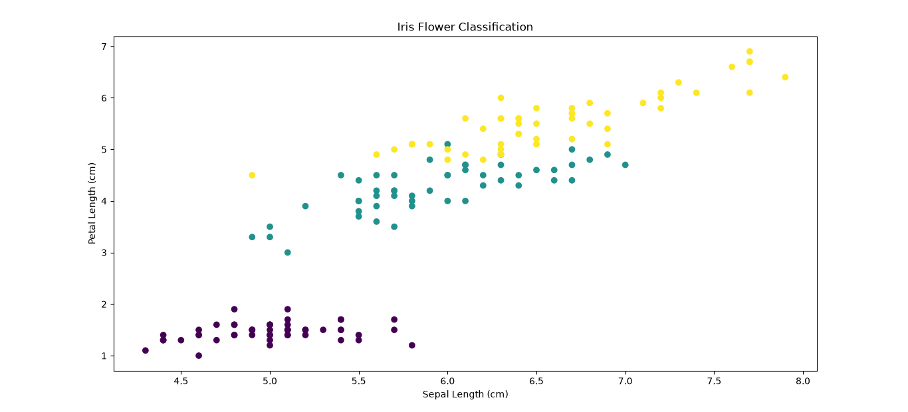

# 🌸 Iris Flower Classification using Machine Learning

## 📌 Project Description

This project was developed as part of the **CodeAlpha Data Science Internship**.

The objective of this project is to classify Iris flowers into one of three species using machine learning. Based on the flower's measurements, the trained model predicts whether the flower belongs to **Iris-setosa**, **Iris-versicolor**, or **Iris-virginica**.

---

# 🎯 Objectives

- Load and understand the Iris dataset.
- Perform data preprocessing.
- Train a K-Nearest Neighbors (KNN) classification model.
- Predict the species of Iris flowers.
- Evaluate the model's accuracy.
- Visualize the dataset.

---

# 📂 Dataset

**Dataset Used:** `Iris.csv`

### Dataset Features

- Sepal Length
- Sepal Width
- Petal Length
- Petal Width
- Species

---

# 🛠 Technologies Used

- Python
- Pandas
- NumPy
- Matplotlib
- Scikit-learn

---

# 🤖 Machine Learning Algorithm

## K-Nearest Neighbors (KNN)

K-Nearest Neighbors (KNN) is a supervised machine learning algorithm used for classification tasks. It classifies new data points based on the majority class of their nearest neighbors.

---

# 📊 Project Workflow

1. Import required libraries.
2. Load the Iris dataset.
3. Remove unnecessary columns.
4. Split the dataset into training and testing sets.
5. Train the KNN model.
6. Predict flower species.
7. Evaluate model accuracy.
8. Predict species for sample input.

---

# 📈 Model Evaluation

The model is evaluated using:

- Accuracy Score

The trained model achieved excellent classification accuracy on the test dataset.

---

# 🚀 Features

- Data Loading
- Data Preprocessing
- KNN Classification
- Species Prediction
- Model Evaluation
- Data Visualization

---

# 📋 Requirements

```
pandas
numpy
matplotlib
scikit-learn
```

---

# ▶️ How to Run

### Clone the repository

```bash
git clone https://github.com/bolluvarshitha142-bit/code_alpha_iris_flower_classification.git
```

### Move to the project folder

```bash
cd code_alpha_iris_flower_classification
```

### Install dependencies

```bash
pip install -r requirements.txt
```

### Run the project

```bash
python iris_classification.py
```

---

# 📸 Project Screenshots

## Graph



---

## Program Output


---

# 📌 Project Outcome

This project demonstrates how machine learning can accurately classify Iris flower species based on flower measurements. It covers the complete machine learning workflow, including data preprocessing, model training, prediction, and evaluation using the K-Nearest Neighbors algorithm.

---

# 👩‍💻 About the Author

**Name:** Bollu Varshitha

**Degree:** B.Tech in Computer Science and Engineering (AI & ML)

**Role:** CodeAlpha Data Science Intern

**GitHub:** https://github.com/bolluvarshitha142-bit

Passionate about Machine Learning, Data Science, and Artificial Intelligence. Interested in building real-world projects and continuously improving programming and problem-solving skills.
